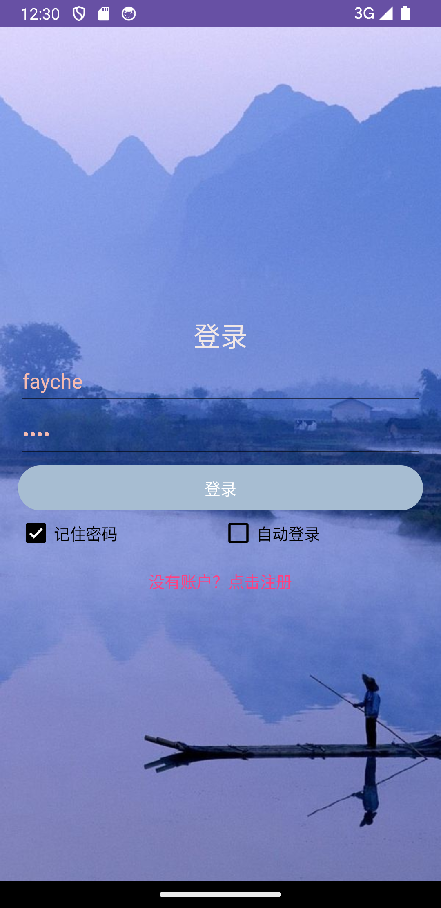
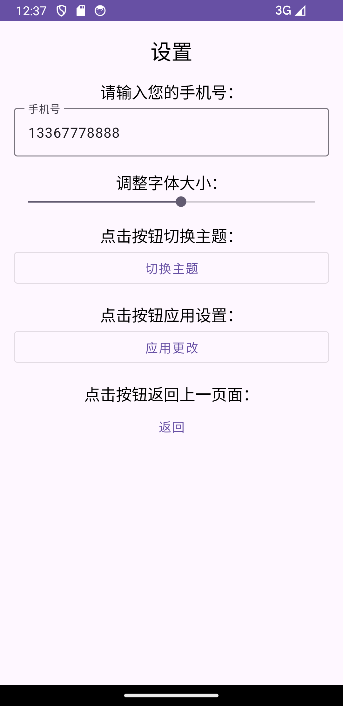
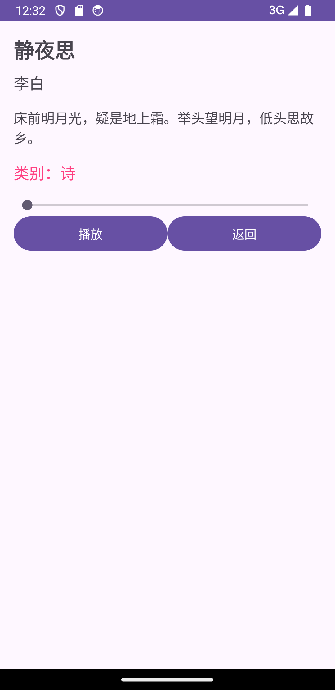
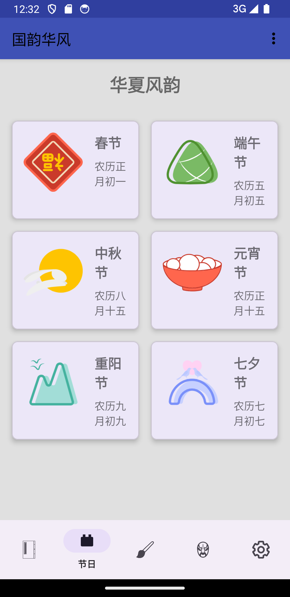
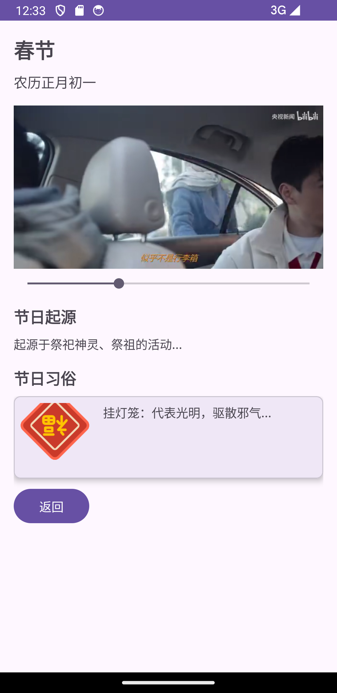
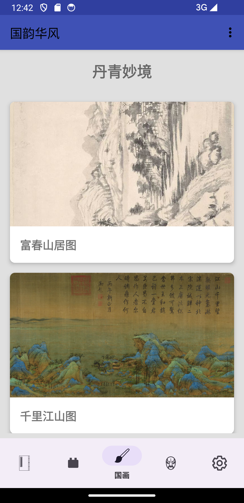
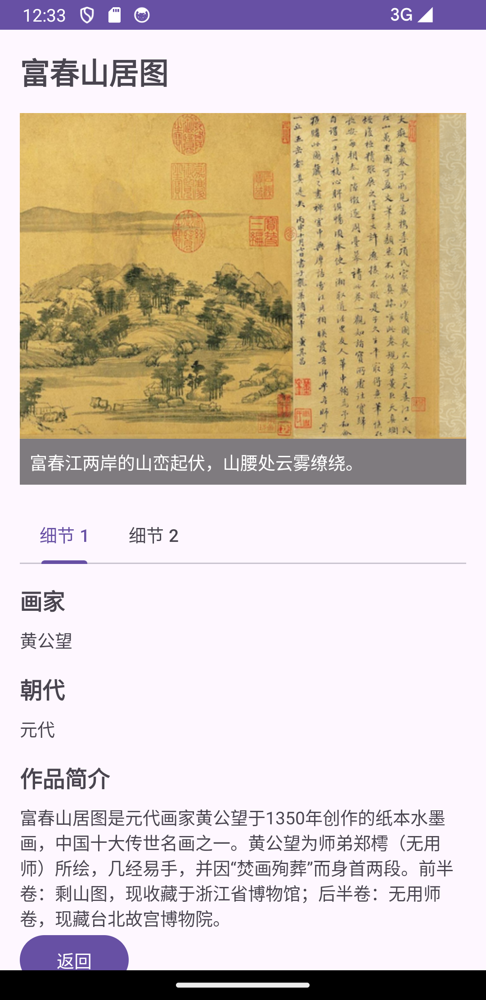
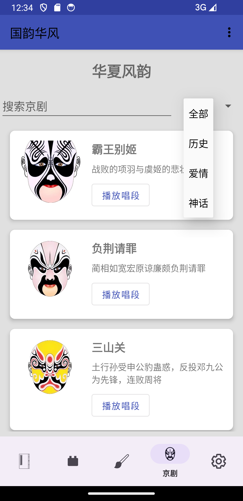
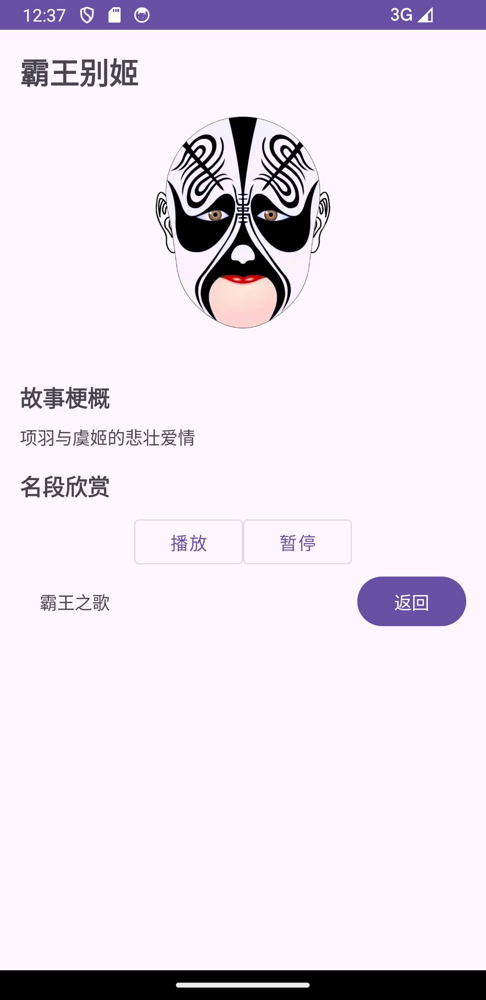

# ChineseStyle

## Introduction
This is a simple app which showcases some Chinese traditional cultures in Chinese style. It is designed as a final project for the course "Mobile Application Development". The app provides a rich and interactive user interface to explore various aspects of Chinese culture.

## Features
- **Traditional Literature**: Explore a wide range of Chinese traditional literature, providing a deep insight into the rich literary heritage of China.
- **Traditional Festivals**: Learn about various Chinese traditional festivals, their significance, and how they are celebrated.
- **Traditional Operas**: Discover the beauty of Chinese traditional operas. Each opera is presented with its unique story, characters, and music.
- **Traditional Paintings**: Admire the elegance of Chinese traditional paintings, each telling a story of its own.

## Technical Details
The app is developed in Java using the Android Studio IDE. It follows the Model-View-Controller (MVC) design pattern for clean and manageable code structure. Data between activities and fragments is managed using Bundles. The app also makes use of RecyclerView for efficient display of lists.

## Getting Started
To get started with the project:

1. Clone the repository: `git clone https://github.com/neverbiasu/ChineseStyle.git`
2. Open the project in Android Studio.
3. Run the project on an emulator or a physical device.

## Show Cases
| Screen | Snapshot | Screen | Snapshot |
|---|---|---|---|
| Login |  | Settings |  |
| Classics Fragment |  | Classic Detail Activity |  |
| Festivals Fragment |  | Festival Detail Activity |  |
| Paintings Fragment |  | Painting Detail Activity |  |
| Operas Fragment |  | Opera Detail Activity |  |

## Contributing
Contributions are welcome! Please read the contributing guidelines before starting.

## License
This project is licensed under the terms of the MIT license.
